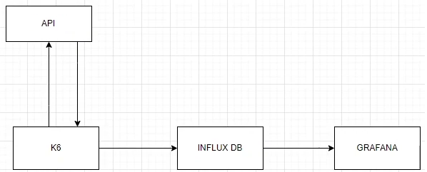

## References

- [GitHub: TIG Stack using InfluxDB 3](https://github.com/InfluxCommunity/TIG-Stack-using-InfluxDB-3)
- [YouTube: TIG Stack using InfluxDB 3](https://www.youtube.com/watch?v=C4aatEAkNao)

---

### **Load Testing Stack**

| Tool         | Purpose                                  |
| ------------ | ---------------------------------------- |
| **Telegraf** | Collect machine data                     |
| **InfluxDB** | Store large volumes of time-stamped data |
| **Grafana**  | Metrics visualization                    |
| **K6**       | Load testing                             |

---

### **Architecture Diagram**

